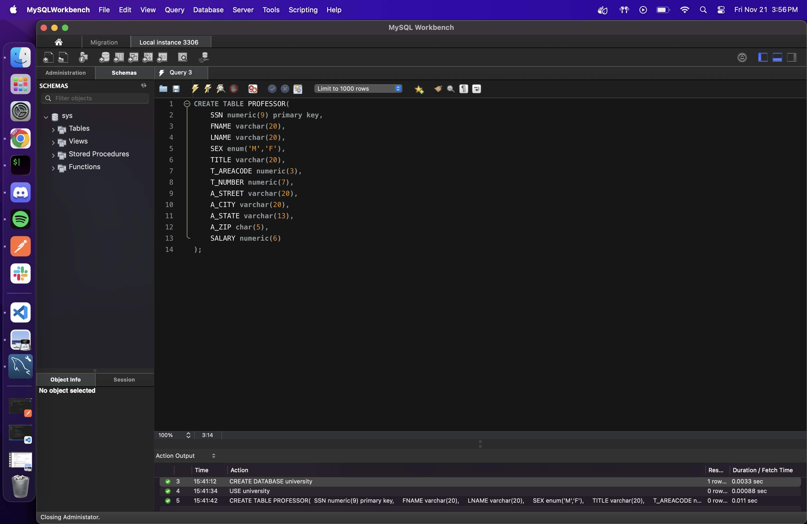

# Creating DDL

After completing the relational models, the next step is to create the database schemas for our project using **DDL (Data Definition Language)**.  
As holistic engineers, we understand the importance of testing our designs before deploying them to the production server (CSUF).

## Using MySQL

To safely test our schema designs, we used **MySQL Workbench** to set up a local server, create a testing database, and validate our DDL scripts.

Below is a preview of the GUI and the SQL code used to create the `Professor` schema.

