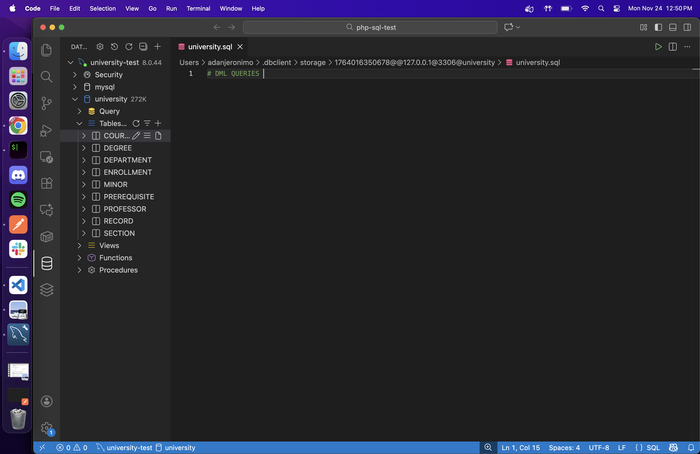

# Using DML

After completing the schemas with DDL in our MySQL test database, it is now time to insert data so that we could test our tables and queries.

## Using VS Code 

We will use VS Code to connect to our MySQL server, using a MySQL extension, and then create DML queries to fill our tables. This will then allow 
us to move to the next step, creating PHP scripts using our tested queries to create a user interface that can acces our database data.

Below is a preview of us connected to our MySQL server via VS Code, we are ready to start DML Queries.

